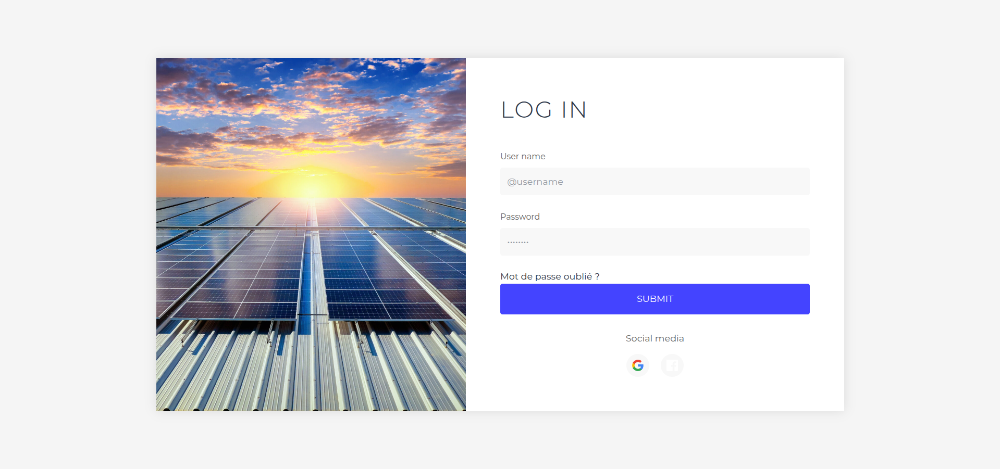
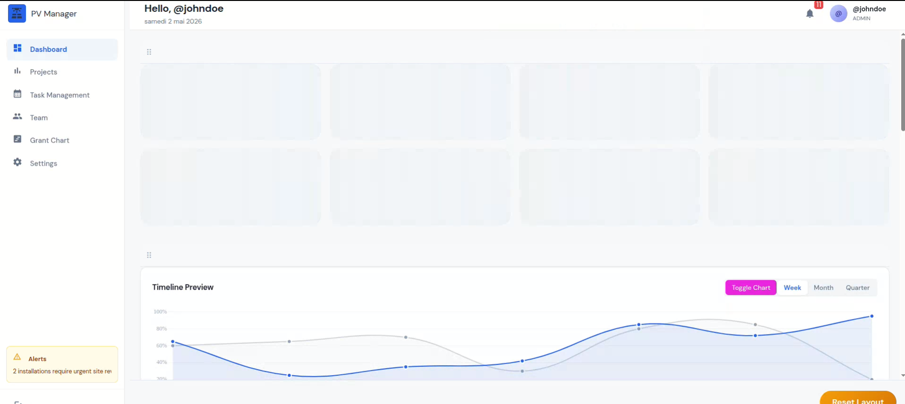
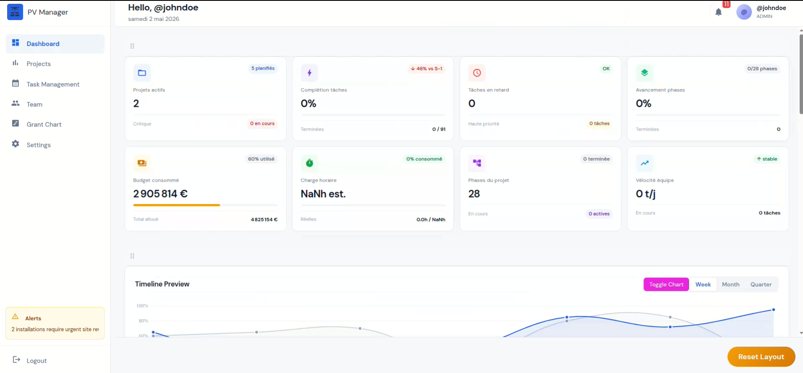
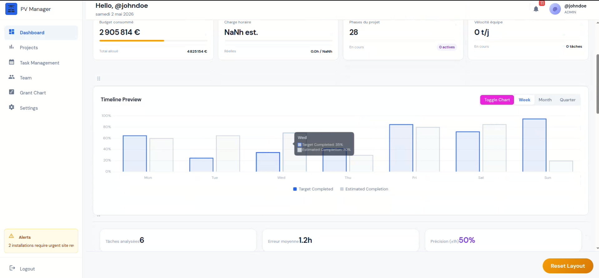
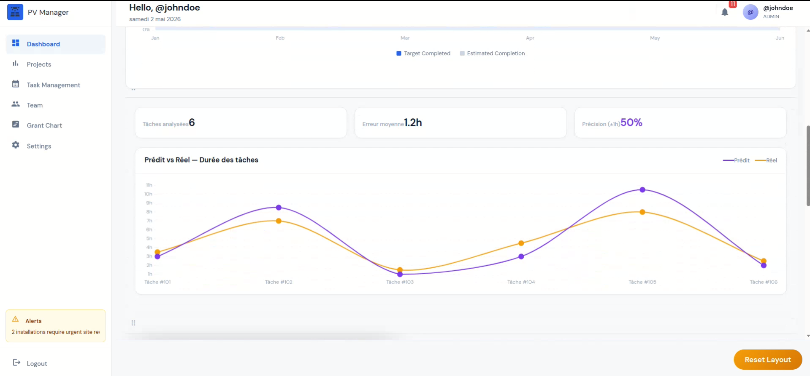
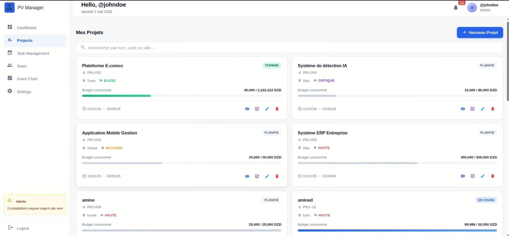
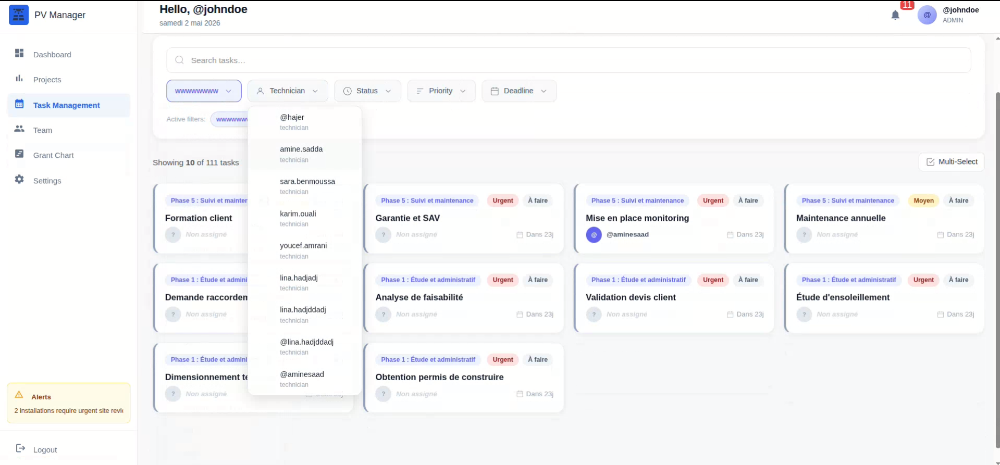
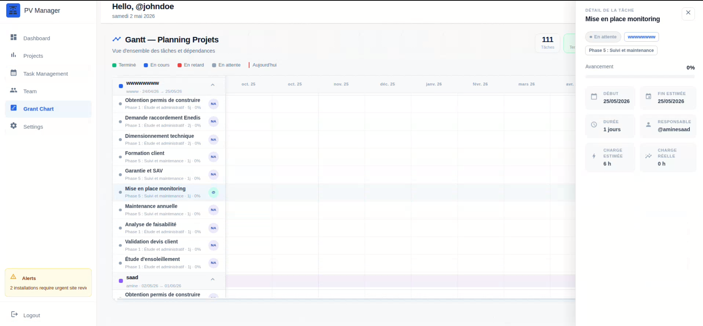
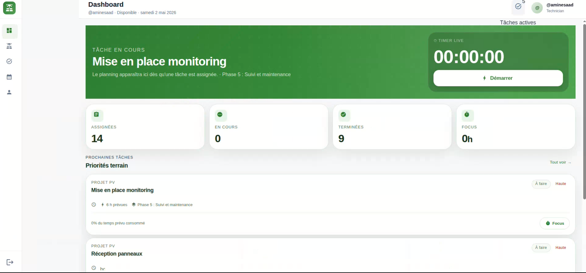

# ☀️ B-Project

A modern web platform for managing photovoltaic installation projects.

---

## 📖 Overview

B-Project is a complete photovoltaic project management platform that helps companies organize, monitor, and manage every phase of solar installation projects.

The platform centralizes project information, customer management, task planning, documentation, equipment tracking, and team collaboration.and optimise the resource using machinelearning modeles 

---

## ✨ Features

- 🔐 Secure Authentication
- 👤 User & Role Management
- 📂 Project Management
- ☀️ Photovoltaic Installation Tracking
- 📅 Task Scheduling
- 📄 Document Management
- 📊 Dashboard & Statistics
- 📍 Project Status Monitoring
- 🔔 Notifications
- 📱 Responsive Design

---


## Login

## 🖥️ Dashboard




---

## 📁 Project Management



---

## 📊 Statistics






---

## Technicien plateforme


---

## 🛠️ Technologies

### Frontend

- Angular
- TypeScript
- HTML5
- CSS3
- Bootstrap

### Backend

- Node.js
- Express.js
- JWT Authentication
- flask(fastapi)

## machine learnig 
  -scikit-learn
  -pytorch

### Database

- MongoDB

---

## 📂 Project Structure

```text
B-Project/
│
├── frontend/
├── backend/
├── MachineLearning
├── images/
├── README.md
└── package.json
```

---

## 🚀 Installation

Clone the repository

```bash
git clone https://github.com/Mohamedaminesaadd/platefome-de-gestion-de-travaill-dans-les-project-photopholtiaque.git
```

Frontend

```bash
cd Frontend
npm install
ng serve -o
```

Backend

```bash
cd backend
npm install
npm run dev
```

---


## 👨‍💻 Authors

Developed as a university engineering project.

---
